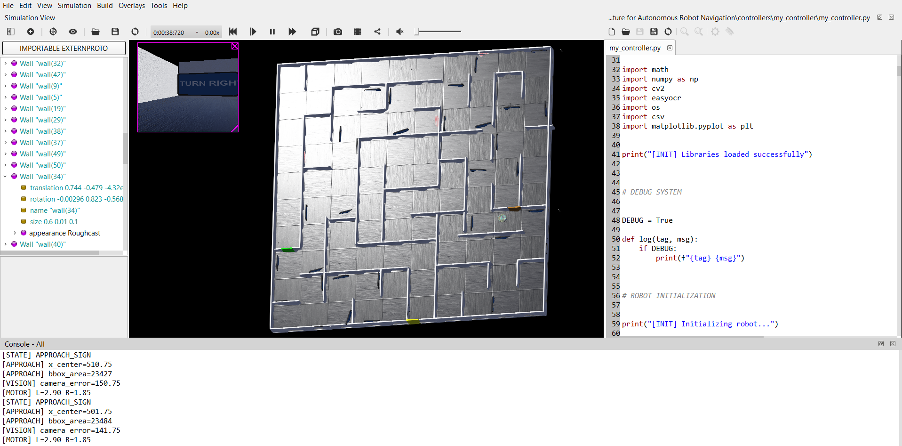

# A Multimodal Artificial Intelligence Architecture for Autonomous Robot Navigation


This project implements a vision-driven autonomous robot navigation system in Webots using an e-puck robot. The robot navigates a maze using OCR-based sign reading, simple NLP interpretation and sensor-based obstacle avoidance.

This world was designed by my lecturer in Sheffield Hallam University and I slightly modified the world for my task. 


A sped-up demo video showing the robot completing the maze is included in the repository.


World Image




## Demo


[Watch Full Demo Video](textures/demo.mp4)

This is sped-up video showing full maze completion.


## Project Goal


The robot is designed to:


 - Detect signs in the environment using a camera.

 - Extract text using OCR (EasyOCR).

 - Convert text into navigation commands.

 - Approach signs and execute actions.

 - Reach the maze exit autonomously.


## System Architecture


```text

                    +-------------------+

                    |      SEARCH       |

                    | Capture Image     |

                    | OCR + NLP         |

                    +---------+---------+

                              |

                              v

                    +-------------------+

                    |   APPROACH _SIGN   |

                    | Track Sign        |

                    | Navigate Forward  |

                    +---------+---------+

                              |

                              v

                    +-------------------+

                    |   EXECUTE _TURN    |

                    | Speak Command     |

                    | Perform Turn      |

                    +---------+---------+

                              |

                              v

                    +-------------------+

                    | FORWARD _AFTER _TURN|

                    | Stabilize Motion  |

                    | Exit Junction     |

                    +---------+---------+

                              |

                              v

                    +-------------------+

                    |      SEARCH       |

                    +---------+---------+

                              |

                              v

                    +-------------------+

                    |       STOP        |

                    | Maze Complete     |

                    +-------------------+


```

 ## Key Idea

The system compares two navigation strategies:

### Version 1: Recommended for speed

- Lightweight FSM controller.

- Minimal computation.

- Fast maze completion, about 3 minutes.

- Uses simple sensor thresholds and OCR trigger logic.


### Version 2: More advanced

- Vision and sensor fusion control.

- Bounding box tracking and smoother navigation.

- Path recording with CSV export.

- More robust, but slower due to extra computation.


In robotics, optimal performance often depends on a trade-off between speed and intelligence. Version 1 prioritizes runtime efficiency, while Version 2 prioritizes robustness.


## Repository Structure


```text

controllers/


    ├── version1 _controller.py

    ├── version2 _controller.py


worlds/


    ├── ArinzeMaze.wbt


protos/

    ├── e-puck robot definition


textures/

    ├── images used in world design


```


## How to Run


1 . Install Webots:  [https://cyberbotics.com/](https://cyberbotics.com/)

2 . Open the project:

   - `worlds/ArinzeMaze.wbt`

3 . Run either controller:

   - Version 1 for a faster solution.

   - Version 2 for improved robustness.


## System Overview


 - Computer Vision: OpenCV + EasyOCR.

 - Control: Finite State Machine (FSM).

 - Navigation: Differential drive + IMU.

 - Sensors: 8× proximity sensors.

 - Output: Speech synthesis + motion execution.


## Optional Improvements


1 . Transformer-based NLP instead of rule-based NLP.

   - Improves robustness in interpreting signs.

   - Increases compute cost.


2 . Speech recognition with OpenAI Whisper.

   - Allows voice-driven interaction.


```python

import whisper


model = whisper.load _model("turbo")

result = model.transcribe("audio.mp3")

print(result ["text"])

```


This can be extended to microphone input for real-time commands.


## Design Philosophy


 - Version 1: prioritize speed and simplicity.

 - Version 2: prioritize perception quality and robustness.

 - The core trade-off is computational cost versus navigation accuracy.


## Summary


This project demonstrates a full multimodal robotics pipeline:


 - Perception: camera + OCR.

 - Reasoning: NLP.

 - Control: FSM + sensors.

 - Execution: robot motion.


